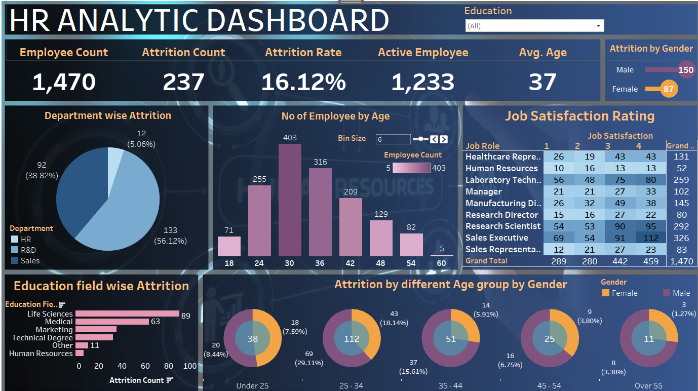

# HR Analytics Dashboard
---

---
## Overview

This project is an HR Analytics Dashboard created using Tableau. The dashboard provides key insights into various HR metrics, such as employee attrition, department-wise statistics, job satisfaction, and employee demographics. The visualizations help identify areas of concern in employee retention and satisfaction, allowing companies to make data-driven decisions to improve their workforce management.

## Key Metrics Visualized

- **Employee Count:** Total number of employees in the organization.
- **Attrition Count and Rate:** Total number of employees who left the company and the corresponding attrition percentage.
- **Active Employees:** Number of employees currently active.
- **Average Employee Age:** Displays the average age of employees in the organization.
- **Department-wise Attrition:** Breakdown of attrition by department (HR, R&D, Sales).
- **No. of Employees by Age:** Distribution of employees across different age groups.
- **Job Satisfaction Rating:** A matrix showing job satisfaction scores across different roles.
- **Education Field-wise Attrition:** Attrition trends based on employees' educational background.
- **Attrition by Gender and Age Group:** Attrition breakdown by gender and age category.

## Features

- **Interactivity:** Filters for education, age, and department allow dynamic exploration of the data.
- **Visual Aids:** Includes pie charts, bar graphs, and heatmaps to make the data easy to understand.
- **Real-time Insights:** Helps HR teams identify areas for improvement in employee retention.

## Tools Used

- **Tableau:** For building the dashboard and visualizing the data.
- **Data Source:** The dataset used for this analysis covers various HR-related metrics including employee demographics, job satisfaction scores, and attrition.

## How to Use

1. **Download the Tableau Workbook:** Clone or download the project from this repository.
2. **Open in Tableau:** Use Tableau Desktop to open the `.twbx` file.
3. **Explore:** Use the filters and interactive elements to explore the HR data.
4. **Analyze:** Leverage the insights to understand workforce trends, identify areas of improvement, and optimize HR processes.

## Conclusion

This dashboard is designed to help HR teams and decision-makers in companies monitor key metrics related to employee satisfaction, attrition, and demographics. It provides a comprehensive view of the workforce and helps in making strategic HR decisions based on data.
